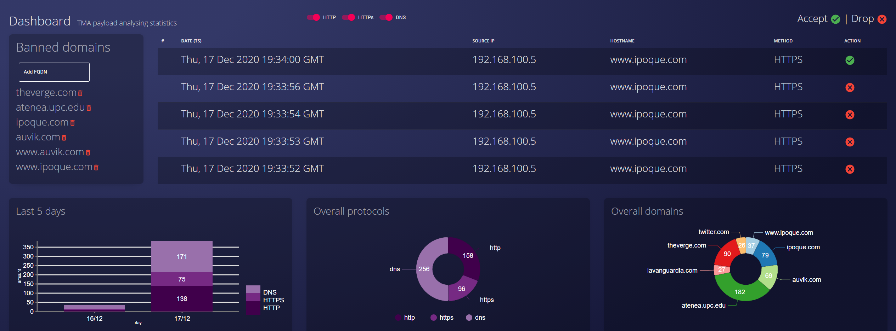

# TMA Packet Action
> The Packet Action was developed as the final project, of Traffic Monitoring analisis Subject of the Mater on Cybersecurity at UPC. Only for educational purposes

This repository is aimed at deploying the smart firewall. There are three directories:
- **Dashboard**: ReactJS Front-END already built in build folder. Just copy what's inside (FYI where index.html is found) to a virtual-host in either Apache or NGINX.
             Also, there is the source code in case you want to check w/e.
- **Kernel**: Linux kernel module for Debian 10 - v4.12. There is a MAKEFILE to compile and insert the module into the kernel. Also contains the JS Backend to provide
             functionalities like changing filters, hostnames.
- **Legit Certs**: Folder with ACME certs to use when presenting at 22/12/2020

Unfortunatelly, built Dashboard is just for you to grab an idea as some AJAX queries are coded to a specific website used for the DEMO.

The repository has the following tree structure:

You will find the Backend for every filter change, hostname in kernel -> js_library. It uses ExpressJS framework to provide routes and so on.


*Dashboard previewing some banned domains along with actions*


## Requirements for this repository
The requirements versions defined below, are the ones used to develop the project:
* GCC 9.3.0
* Make v4.2.1
* Linux Kernel v4.19 & appropiate headers
* NodeJS v10 - NPM ^6
* Apache v2.4
* Certbot - Generating verified certificates for DEMO

## Installing
RELATED TO KERNEL MODULE BUILDING
```bash
sudo apt-get install git fakeroot build-essential ncurses-dev xz-utils libssl-dev bc make cmake gcc
sudo apt-get install kernel-headers-$(uname -r)
```
Then use the makefile provided in the kernel folder to compile and do further testing within the kernel. Also you can use **dmesg** to see kernel buffer in case
you debug the module. There are further instructions within kernel folder.

RELATED TO BACK-END or FRONT-END
```bash
sudo apt-get install npm nodejs certbot apache2 
```
You must install npm_modules using npm install within the root folder of either Backend or Frontend. Then, there are scripts such as:
```bash
npm start // Start the backend | Start the frontend
npm run build // Build ONLY the frontend, so you can later deploy it in APACHE or NGINX.
```

## Contributors
@[Marti Miquel](https://github.com/MartiMiquel) \
@[Èric Monné](https://github.com/orgs/TMASmartFirewall/people/xemyst)
